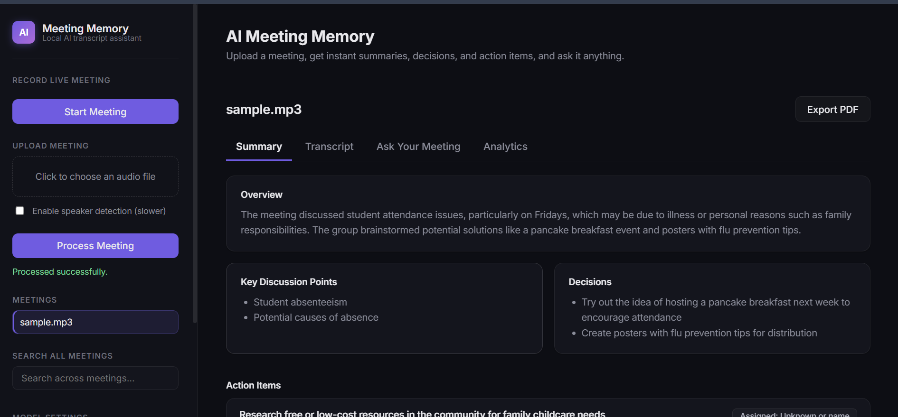
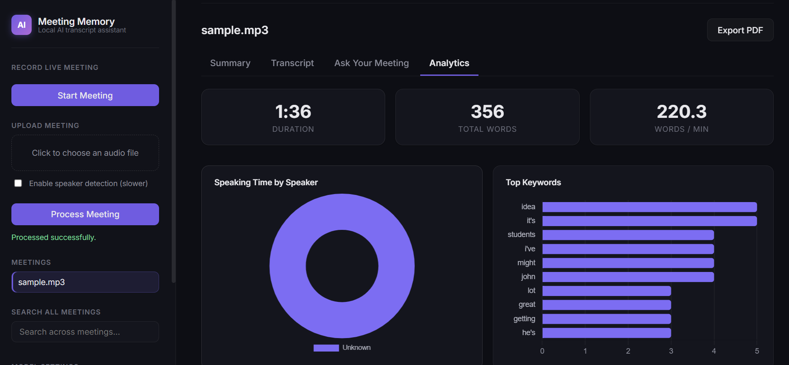
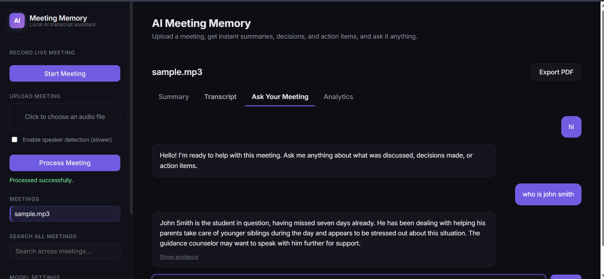

# 🧠 AI Meeting Memory

**An AI-powered meeting intelligence system that transcribes, summarizes, and lets you ask questions about your meetings — all running locally on your own machine.**

[](https://www.python.org/)
[](https://fastapi.tiangolo.com/)
[](https://github.com/openai/whisper)
[](https://ollama.com/)
[](LICENSE)

---

## 📌 Problem

Meetings generate a huge amount of spoken information that is easy to forget and tedious to review. Manually re-listening to recordings or reading long transcripts to find "what did we decide about X?" or "who was assigned Y?" wastes time and often key details, decisions, and action items get lost entirely.

## 💡 Solution

**AI Meeting Memory** turns a raw meeting recording — uploaded as a file or captured live from the microphone — into:

- A clean, timestamped, speaker-labeled transcript
- A structured summary (overview, key discussion points, decisions, action items)
- A searchable knowledge base you can ask natural-language questions against, with every answer backed by evidence from the actual transcript

It is built as a full local AI pipeline: **Speech-to-Text → NLP Cleaning → Chunking → Embeddings → Vector Search → Retrieval-Augmented Generation (RAG) → LLM Summarization**, with every model running on your own machine — no data ever leaves your computer, and no paid API is required.

---

## ✨ Features

| Feature | Description |
|---|---|
| 🎙️ **Audio Upload & Live Recording** | Upload an MP3/WAV/M4A file, or record a meeting live from the browser microphone |
| 📝 **Speech-to-Text** | Local transcription via OpenAI Whisper (`faster-whisper`), with timestamps |
| 🗣️ **Speaker Diarization** | Identifies "who spoke when" using `pyannote.audio` (optional, toggle-able for speed) |
| 🧹 **Transcript Cleaning** | Removes filler artifacts, repeated words, and normalizes punctuation |
| 📋 **AI Summarization** | Structured overview, key points, decisions, and action items via a local LLM (Ollama + Llama 3.2) |
| 🔎 **RAG-based Q&A** | Ask natural-language questions about a meeting; answers are grounded in retrieved transcript evidence, with an explicit "I don't know" fallback to reduce hallucination |
| 🌐 **Cross-Meeting Search** | Semantically search across every processed meeting at once |
| 📊 **Meeting Analytics** | Talk-time by speaker, keyword frequency, and activity-over-time charts |
| 📄 **PDF Export** | Generates a professionally formatted "Minutes of Meeting" PDF |
| 🌍 **Multilingual Input** | Transcribes Urdu (or mixed Urdu/English) audio; summaries and chatbot answers are always produced in English |
| 🌓 **Dark / Light Theme** | Full theme switch with persistence |
| 🔒 **Fully Local & Private** | All models (Whisper, embeddings, LLM, diarization) run on-device; no data is sent to any third-party API |


---

## 📸 Screenshots

| Summary View | Analytics Dashboard |
|---|---|
|  |  |

| Ask Your Meeting (Chat) |
|---|
|  |

---

## 🏗️ Architecture

```text
Audio (upload or live mic recording)
        │
        ▼
Speech-to-Text (faster-whisper)
        │
        ▼
Speaker Diarization (pyannote.audio) ── optional
        │
        ▼
Transcript Cleaning & Normalization
        │
        ▼
Chunking (overlapping, timestamp-aware)
        │
        ▼
Embedding Generation (sentence-transformers)
        │
        ▼
Vector Database (ChromaDB)
        │
        ├──────────────► Summarization (Ollama / Llama 3.2) ──► Structured Summary + PDF Export
        │
        ▼
Retriever ──► RAG Pipeline ──► LLM ──► Answer + Evidence (Chat UI)
```

The system is split into a **FastAPI backend** (`app/api_server.py`) that exposes the full pipeline as a REST API, and a **custom HTML/CSS/JS frontend** (`app/web/`) that consumes it. Business logic lives entirely in `src/`, organized by pipeline stage, so any component (e.g. the LLM provider, or the embedding model) can be swapped without touching the rest of the system.

---

## 🧰 Tech Stack

| Layer | Technology |
|---|---|
| Speech-to-Text | [faster-whisper](https://github.com/SYSTRAN/faster-whisper) (Whisper `base` model) |
| Speaker Diarization | [pyannote.audio](https://github.com/pyannote/pyannote-audio) |
| Embeddings | [sentence-transformers](https://www.sbert.net/) (`all-MiniLM-L6-v2`, or multilingual variant) |
| Vector Database | [ChromaDB](https://www.trychroma.com/) |
| LLM (Summarization & Q&A) | [Ollama](https://ollama.com/) running [Llama 3.2](https://ollama.com/library/llama3.2) (local, free) |
| Backend | [FastAPI](https://fastapi.tiangolo.com/) + Uvicorn |
| Frontend | Vanilla HTML / CSS / JavaScript + [Chart.js](https://www.chartjs.org/) |
| PDF Generation | [fpdf2](https://pyfpdf.github.io/fpdf2/) |
| Testing | [pytest](https://pytest.org/) |
| Audio Conversion | [FFmpeg](https://ffmpeg.org/) |

---

## ⚙️ Installation

### Prerequisites

- **Python 3.12+**
- **[Ollama](https://ollama.com/download)** installed and running
- **[FFmpeg](https://www.gyan.dev/ffmpeg/builds/)** installed and available on your system PATH
- (Optional, for speaker diarization) A free **[Hugging Face](https://huggingface.co/join)** account and access token, with the license accepted on:
  - [pyannote/speaker-diarization-3.1](https://huggingface.co/pyannote/speaker-diarization-3.1)
  - [pyannote/segmentation-3.0](https://huggingface.co/pyannote/segmentation-3.0)
  - [pyannote/speaker-diarization-community-1](https://huggingface.co/pyannote/speaker-diarization-community-1)

### 1. Clone the repository

```bash
git clone https://github.com/HussnainAnjum28/ai-meeting-memory.git
cd ai-meeting-memory
```

### 2. Create and activate a virtual environment

```bash
python -m venv venv

# Windows
venv\Scripts\activate

# macOS / Linux
source venv/bin/activate
```

### 3. Install dependencies

```bash
pip install -r requirements.txt
```

### 4. Pull the LLM model via Ollama

```bash
ollama pull llama3.2
```

### 5. Configure environment variables

Copy `.env.example` to `.env` and fill in your Hugging Face token (only required if you want speaker diarization):

```bash
copy .env.example .env      # Windows
cp .env.example .env        # macOS / Linux
```

```env
HF_TOKEN=your_huggingface_token_here
```

---

## 🚀 Usage

The application has two parts that need to run at the same time: the backend API and the frontend.

### 1. Start the backend (Terminal 1)

```bash
uvicorn app.api_server:app --reload --port 8000
```

Wait until the terminal shows:

### 2. Start the frontend (Terminal 2)

```bash
cd app/web
python -m http.server 3000
```

### 3. Open the app

Go to [http://localhost:3000](http://localhost:3000) in your browser.

From there you can:
- **Upload** a meeting audio file (`.mp3`, `.wav`, `.m4a`, `.webm`), or
- **Record live** using the "Start Meeting" / "End Meeting" buttons (requires microphone access)

Once processed, you can view the **Summary**, **Transcript**, **Analytics**, ask questions in **Ask Your Meeting**, export a **PDF**, or search across all meetings from the sidebar.

### API documentation

FastAPI auto-generates interactive API docs at [http://localhost:8000/docs](http://localhost:8000/docs), where every endpoint can be tested directly.

---

## 📊 Evaluation

A lightweight evaluation script (`evaluation/evaluate.py`) measures pipeline quality against a hand-labeled test set (`evaluation/test_cases.json`):

```bash
python evaluation/evaluate.py
```

**Sample results** (7 test questions against a real meeting transcript):

| Metric | Result |
|---|---|
| Retrieval Recall@K | 100.0% |
| Answer Correctness | 100.0% |
| Hallucination Rate | 33.3% |

The hallucination rate measures how often the system invents an answer to a question that has **no** answer in the transcript, instead of correctly saying it could not find the information. This is documented honestly as a known limitation (see below) rather than hidden.

---

## ✅ Testing

Unit tests cover transcript cleaning, chunking, and summary JSON parsing, using small hand-crafted fixtures (no real audio or LLM calls required, so the suite runs in well under a second):

```bash
pytest tests/ -v
```

---

## ⚠️ Limitations

- **Hallucination on out-of-scope questions**: the LLM occasionally invents an answer to questions with no basis in the transcript, rather than declining (~33% in evaluation testing). Mitigated by an explicit "don't know" instruction in the prompt, but not eliminated.
- **CPU-only inference is slow**: transcription, diarization, and LLM generation all run on CPU by default, so processing a meeting can take several minutes. Speaker diarization can be disabled per-upload for faster processing.
- **In-memory meeting storage**: processed meeting data is held in server memory and is lost on server restart (the underlying audio and vector embeddings are still saved to disk). A production version would persist this to a database.
- **Small local LLM for non-English generation**: Llama 3.2 (3B) can transcribe Urdu audio accurately, but is not reliable at generating fluent Urdu text, so summaries and chat answers are always produced in English regardless of the meeting's spoken language.
- **Speaker labels are not named**: diarization identifies distinct speakers (`SPEAKER_00`, `SPEAKER_01`, ...) by voice, but has no way to know their real names.

---

## 🔮 Future Improvements

- Persistent database storage for processed meetings (replacing in-memory storage)
- User-editable speaker names (renaming `SPEAKER_00` to a real name)
- Calendar integration for automatic meeting scheduling and upload
- Automatic email/task generation from action items
- Cloud deployment with a hosted LLM provider for faster inference

---

## 📄 License

This project is licensed under the MIT License — see the [LICENSE](LICENSE) file for details.

---

## 🙋 Author

Built by [Hussnain Anjum](https://github.com/HussnainAnjum28) as an AI/ML portfolio project, demonstrating a full local, privacy-preserving AI pipeline: speech recognition, NLP, embeddings, vector search, RAG, and LLM-based generation.

